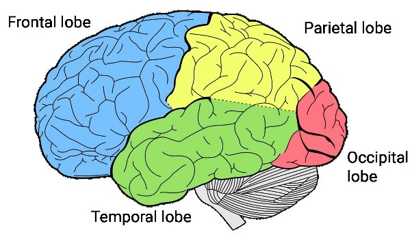
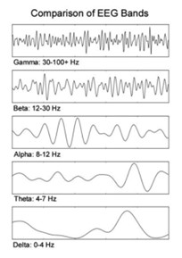
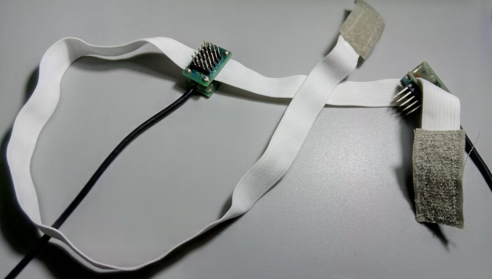

# Theory

The electroencephalogram is at first sight a complex device, but its principles are quite simple. The average person does not encounter it every day, so it is necessary to describe the theory in detail. We should start nicely from the beginning.

## Human body (brain)

The human body, as it is known, is essentially one big electrochemical cell. It uses electrical impulses to move muscles and transmit information. Although scientists have been studying it for many centuries, it is still not understood how many things work; we can sometimes only speculate about the function of some of the components of this complex machine.

As the most important organ of our body, some of the brain's functions remain undiscovered. However, the brain is not "only" important in keeping our body alive, it houses our consciousness; without the brain as a control processor, our body would not know what to do and would be inactive. Of course it maintains important life functions, but with medical advances it is possible to keep a person alive even without brain function. In our opinion, it will not be long before the world will witness the first brain or head transplants.

Just as the whole body works on the electrochemical principle, the brain stores our memories, perceives through the senses and processes all information in the same way. While chemical reactions would be difficult for us to measure and ascertain their purpose, electricity can be manipulated by mankind in a rather advanced way. We owe the fact that we can pick up these electrical impulses in a non-invasive way to the relative conductivity of our bodies.

The number of nerve cells in the brain is estimated to be 10^11; cortical neurons are strongly interconnected. The surface of a neuron can be covered with up to 1000-100,000 synapses (the point of connection with other neurons). The resting voltage is around -70 mV and at peak action the potential is positive. The amplitude of the nerve impulse is about 100 mV and lasts about 1 ms.

## EEG

The first recording of the electric field of the human brain was demonstrated by the German psychiatrist Hans Berger in 1924 in Jena. He named the recording the electroencephalogram (EEG). From 1929 to 1938 he published 20 scientific papers on the EEG under the same title "Über das Elektroenkephalogram des Menschen".

EEG can sense three kinds of brain activity:

1. Spontaneous activity
2. Evoked potentials
3. Bioelectrical events of individual neurons

**Spontaneous activity** is measured on the scalp "non-invasively" or on the surface of the brain "invasively". The EEG amplitude is approximately 100 μV when measured on the scalp and approximately 1 to 2 mV when measured on the surface of the brain. The bandwidth of this signal is from 1 Hz to ~50 Hz. However, individual frequencies have different amplitudes; Figure 1-1 shows the relative amplitude to each frequency. As the phrase "spontaneous activity" implies, this activity continues uninterrupted throughout a person's life.

**Evoked potentials** are those components of the EEG that arise in response to a stimulus (which may be electrical, auditory, visual, etc.). Such signals are usually below the noise level and are therefore not easily distinguishable, and it is necessary to use a large number of stimuli and signal averaging to improve the signal-to-noise ratio.

**Single neuron events** can be studied using microelectrodes that are injected into the cells of interest. Through single-cell studies, we hope to create models of cellular networks that reflect the true properties of brain tissues.

### Electrode placement

We usually use the internationally standardised 10-20 system to record spontaneous activity. In this system, 21 electrodes are placed on the surface of the scalp, as shown in Figure 1-2. The positions are determined as follows: the reference points are the "nasion," which is located at the top of the nose, level with the eyes; and the "inion," which is essentially a bony lump at the base of the skull on the midline of the back of the head.

From these points the circumference of the skull is measured in the transverse and median planes. The location of the electrodes is determined by dividing these circumferences into 10% and 20% sections. Three additional electrodes are placed on each side equidistant from adjacent points, as also shown in the figures.

In addition to the 21 electrodes of the international 10-20 system, the 5-10 system, which uses a denser arrangement, is also used. There are also many other electrode systems for recording electrical potentials on the scalp. The "Queen Square" electrode placement system has been proposed as the standard for recording built-up potentials in clinical trials.

Bipolar or unipolar electrodes can be used in EEG measurements. With bipolar, the potential difference between the two electrodes is recognized. In the latter method, the potential of each electrode is compared with either the neutral electrode or the average of all electrodes.

### The sources of EEG signal

In the figure above you can see how our brain is divided into different sectors. Thus, when the EEG senses the time course of electrical activity generated by the brain, we can capture specific waves of our interest because we know approximately which areas of the brain are responsible for processing information at any given time:

**Occipital lobe** - This part of the brain is mainly responsible for processing visual information. It is usually where we measure the reception of visual stimuli (video, pictures).

**Parietal lobe** - The parietal lobe is very important in processing sensory information from different parts of the body, knowledge of numbers and their relationships, and manipulation of objects. Its function is also to process information related to the sense of touch. A part of the temporal lobe deals with spatial vision.

**Temporal lobe** - The temporal lobe has external parts that are responsible for language processing and speech production. The inner regions are more active during spatial navigation. You may have heard of the hippocampus: This is the brain region in the temporal lobe where we form spatial and autobiographical memories from, for example, early childhood days. It is also referred to as the primary area for auditory processing.

**Frontal lobe** - The frontal part of the human brain is enlarged compared to other mammals. Basically, the frontal cortex is in charge of cognitive control: it keeps us from running after flashing lights, forces us to complete studies, and connects different memories and experiences into a consistent whole. In other words, we are able to move voluntarily thanks to it, to make simulations of the future and simulations of the consequences of our actions (to decide between good and evil).

### The structure of EEG signal

In addition to the area characteristics from which certain electrical activity originates, we can also analyze which frequencies drive the ongoing activity. Whenever our brain is in a certain state, the frequency patterns change.

**Delta δ (1-4 Hz)** - In sleep labs, delta waves are studied to assess the depth of sleep. The stronger the delta rhythm, the deeper the sleep. Interestingly, delta waves are only present in non-REM (Rapid Eye Movement) phases - when we are not dreaming, for example.

**Theta θ (4 - 8 Hz)** - Theta is associated with a wide range of cognitive processes, such as encoding and memory retrieval, but it depends on the area.

**Alpha α (8 - 12 Hz)** - Alpha waves can be observed mainly when relaxing with eyes closed. EEG training often uses alpha waves to monitor relaxation.

**Beta β (12 - 25 Hz)** - Commonly seen in people with normal waking consciousness. In motor areas, beta frequencies become stronger when we perform or plan to perform movements of any part of the body. Interestingly, this increase in beta is also noticeable when we observe other people's body movements. Our brains seemingly mimic the movements of their limbs, suggesting that there is a complex "mirror neuron system" in our brains that is coordinated by beta frequencies.

**Gamma γ (>25 Hz, typically 40 Hz)** - Currently the gamma frequencies are the black holes of EEG research. Some researchers argue that gamma reflects strong concentration and serves as a carrier frequency to facilitate data exchange between brain regions. Others associate gamma with rapid eye movements, the so-called "microsaccades," which are thought to be essential parts for sensory processing and information capture.

EEG also has a great use in medicine, mainly because it can detect epileptic seizures that whether a person is susceptible. EEG in epileptic seizure records unambiguous regular pulses with high amplitude, as you can see in the picture. However, we know many types of epilepsy and their EEG may look different, however most of the time it is easily detectable.

## Hardware

Electroencephalographic measurements use a recording system consisting of:

- electrodes (usually with conductive media)
- amplifiers and filters
- A/D converter
- recording equipment

The electrodes read the signal from the surface of the head, the amplifiers transmit the microvolt signals to a range where they can be accurately digitised, the transducer converts the signals from analogue to digital form, and personal computers (or other relevant equipment) store, process and display the acquired data. The amplifiers with filters and the A/D converter are usually housed in a single device called a BCI (Brain-Computer Interface). The main intention of this work is to create this device.

The best way to explain this is to use the device itself, so I give examples of the components we will use, although there are many other variations.

### Electrodes

In our device, we will use so-called active electrodes, which, because they amplify the signal as soon as it is recorded, will not be so susceptible to signal interference on the way to the amplifier. We don't have to worry that the electrodes will be big because of this, of course they will be bigger than passive electrodes, but with a low number of channels it doesn't matter at all. Our EEG will be expandable up to 6 channels in a bipolar circuit, that means 12 electrodes plus 1 DRL for connection. This is a decent expandability in our opinion. The active electrodes we will make will be only 14x22mm, will be able to penetrate through the hair directly to the skin using pins, and can also be clamped on a rubber band for attachment to the head. Active electrode construction developed by us:

The DRL (Driven Right Leg) electrode is very important because it picks up a reference signal from some neutral location on our body and subtracts the recorded signal from all channels. This way we largely eliminate interference from the surroundings and our own body. The DRL electrode must be passive because the use of an active electrode would not allow it to function properly. Reference DRL wiring:

The length of the electrode cable is critical at such small voltages, generally a length of around one metre is recommended for the device we make. We use 3.5mm jacks to connect the electrodes to the BCI, but this is specific to each type of device separately.

### Amplifiers and filters

The first amplification stage in our device is located at the active electrodes. The captured and slightly amplified signal then travels to the instrument itself, where it is the turn of the instrumentation amplifier, which is basically several operational amplifiers specially interconnected in one package. It has a dual function, to read out the captured signal of the DRL electrode and to accurately amplify the as yet very weak signal.

Next comes the dual operational amplifier, which also performs a dual function. The first serves as a trimmer-adjustable gain control to calibrate the signal amplitude. The second serves as a third-order Bessel-type low-pass filter, i.e. it "cuts off" all frequencies above 152Hz. This is a very beneficial effect, since we need frequencies in the 1-50Hz range and all other frequencies are simply interference. Interference from either the mains or other electronic equipment is usually removed or attenuated by the DRL system already in use.

The basic gain after all these stages should be G=7812.5, which can be further tuned. The passband filter should be in the range 0.16-152Hz.

### A/D converter

It is an integral part of the whole device that allows us to view, record and edit the signal on digital devices, not just on the oscilloscope. The output from the amplifier cascade terminates on one of the pins of the A/D converter, in this case in the form of an ATMega16 microprocessor. We use a sampling resolution of 10 bit i.e. 1024 possible values on a 0-4V scale. This, after subtracting the gain, gives a range at the input of 512µV at 0.5µV resolution. Since the captured signal is in the region of 100µV this is adequate.

### Recording device

Once the signal has been successfully digitised, we need to send that data on for processing. The best way to do this would be to use a universal form of connection to computing and what is more universal than a universal serial bus (USB).

The ATMega16 microprocessor somehow does not support USB connectivity, but it can send data via UART (universal serial communication). Although UART is not directly compatible with USB, there are a number of chips from different manufacturers that can interconnect them. I decided to go the modern route and use the latest chips from Silicon Labs. The CP2102N chip offers more than enough data throughput, a wide range of features in a small form factor and at a reasonable price. Reliability was also a critical factor.

However, since we decided to use power directly from the USB interface, it is necessary to isolate our device from the surrounding environment for safety. We achieved this by using an isolation 5V-5V DC-DC converter for the power supply and a chip to isolate the data connection also from Silicon Labs.

Due to the modularity of our device, this USB/UART converter will be able to be used in applications other than EEG. The reverse is also true, it is possible to create arbitrary interfaces using e.g. Bluetooth technology, where we ensure complete isolation from the environment when powered by the battery.

Thanks to the IDC connectors used, modularity is easy, no special connectors, all one needs to know is the pin layout.

### Software

We decided not to spend a lot of time on software because of the open-source solutions that already exist. However, that doesn't mean we don't need to spend time on it at all. We plan to create simple software in the future designed to control the EEG power supply.

We will use "BrainBay" as the main program to display and process the EEG data. But in general, we can use any program supporting OpenEEG packet composition version 2. The interface of this program is quite simple and user-friendly. It supports signal acquisition from multiple sources and a wide range of modifications to these signals. On the output we can display a digital oscilloscope, frequency analyzer, MIDI synthesizer, visualization, various graphs, columns and much more. This program also supports logging of the acquired data.

[Next page](./2_goals.md)

*Translated by DeepL.*
