# Methodology

The methodology will be written in a way that any electronics enthusiast with more advanced knowledge and experience of PCB fabrication and component assembly can understand.

## Open-source licensing

We decided to go the route of an open source project, as it would have taken us months if not years of focus to build a schema from the ground up and test the wiring.

The OpenEEG project was exactly what we were looking for. Not only did a group of enthusiasts create a schema and a way to get involved, but they also created a community. While it's true that this project is older (~2005) and fewer and fewer people refer to this project, if we had a question about the project, there was always someone who could help us via email.

This project is licensed under a Creative Commons Attribution - ShareAlike license. This means that this project can be used and shared without restriction as long as the source is credited and the same license is used. I plan to share this iteration of the project once I have completed the design and schematic. Definitely sounds interesting to contribute to such a great community of enthusiasts. Hoping that our work will help someone who may be doing a similar vintage project, well that's the future...

Although we're not using the original ModularEEG project, but an iteration of it optimized for direct USB connectivity, compact size, and use of SMD components called EEG-SMT. I can and must stick to the original license. This iteration was made by Olimex Ltd, a Bulgarian company based in Plodiv, Bulgaria's second largest city. This company sells parts and finished electronic projects. And thanks to that license, it was necessary for them to also share their schematics and PCB designs, which we customized. The modified schematic:

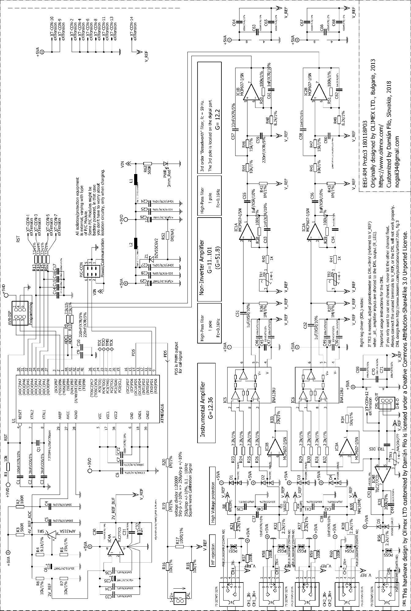

## Component selection

Since Olimex has access to a quasi-limitless amount of those specific parts, we didn't have that option. We used various sites as sources of parts, such as AliExpress for connectors and cables, where you can get such parts cheap and of good quality. For the rest of the functional parts (resistors, capacitors, integrated circuits...) we used the Mouser site, where they have a very wide selection and free shipping for orders over 50$. Later we had to reorder some parts through a friend because we made some changes in the design. The lesson learned was: Order only the final selection of parts, think carefully.

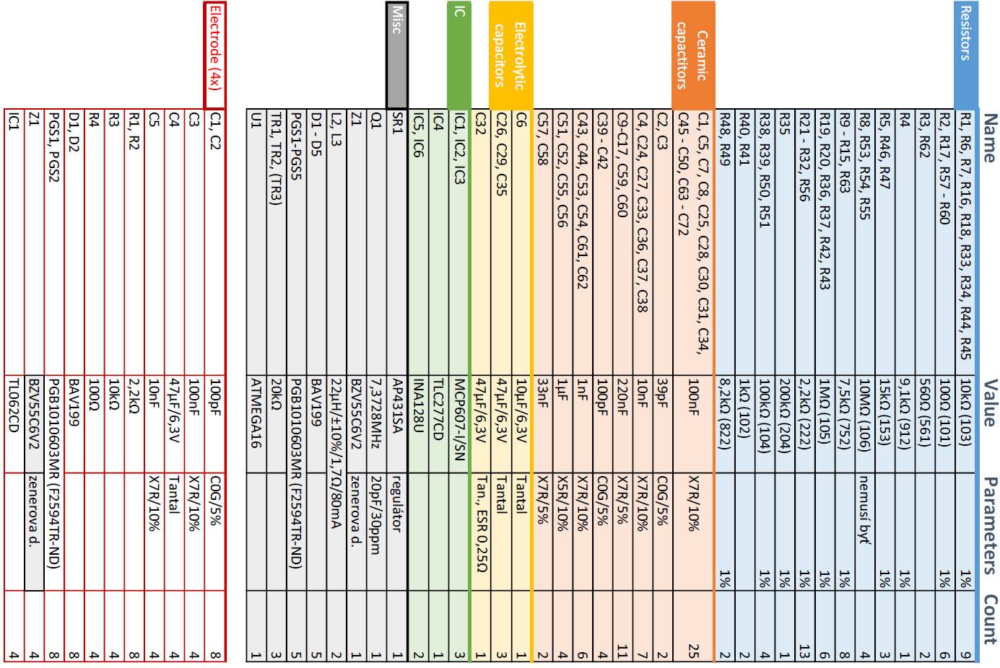

## First prototype

This was our first experimental design on which we honed our skills with Eagle. It took us at least 3 weeks to modify the schematic and design the PCB. That's not counting the actual product. However, it was accompanied by a few complications, which fortunately were solved "painlessly". For etching I used a solution of hydrochloric acid and hydrogen peroxide.

The first complication was insufficient silver plating of the PCB, this translated into insufficient adhesion of tin to copper, which corroded due to the environment. Being silver plated, the tin spilled out seamlessly. Although there was a higher risk of a cold joint (electrically non-conductive), it was possible to solder all the components together.

The other not-so-big complication was using smaller SMD parts (0603) than I used in the design (0805). This had the effect of reducing the neatness of the PCB and making it more difficult to store and solder the components.

The third, rather unpleasant complication was the very imperfect etching, soldering and fixing of the MicroUSB connector located directly on the board. It had to be in a specific position for it to be used at all. Since Prototype 1 also had an IDC connector for power and communication, it was only meant at the time as an I/O for data and an output for power. Thus, MicroUSB held the main role of powering the circuits and had no data pins connected. Later, after re-evaluating the pros/cons, we decided to merge it with the IDC connector and thus called it Power/Communication Connector (P/C CON) to which the P/C Module connects. It acts as a power supply to the EEG and communication with surrounding devices (depending on the module used).

The fourth complication was the inexperience of programming ATmega microprocessors. When first programmed and connected to the computer, the EEG sent nonsensical data. Upon later discovery we found out that it only worked on an internal clock of 1MHz, This caused insufficient data processing speed and slow data sending. As we are using UART technology and within it we need to choose a fixed baud rate as a requirement for correct communication between devices. The crystal of unconventional frequency of 7.3728MHz guarantees the correct frequency of sending data through UART, where it is allowed to multiply/divide this frequency for our requirements. The simple solution to this awkward situation was to set the configuration fuses correctly during programming. This allowed us to activate the external crystal and use its frequency.

Although we were unable to test Prototype 1 with electrodes, due to the swapping of the power and signal pins in the jack used in the wiring in Prototype 2, overall Prototype 1 can be called a success. Its schematic, photos and design can be found as attachments. The design of the first prototype:

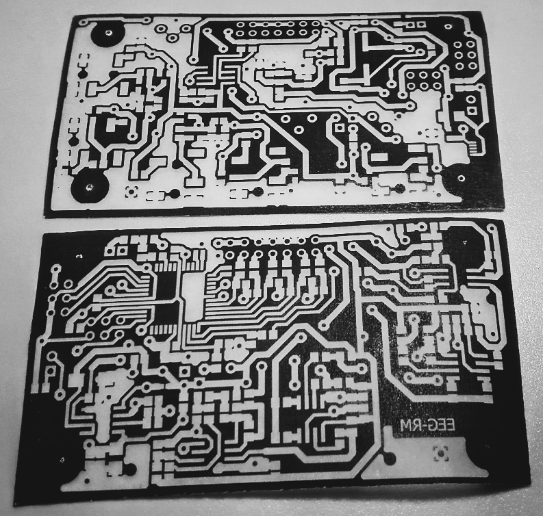

## Electrodes

The biggest challenge in designing the electrodes was figuring out their construction. We were very interested and inspired by the work of Jim Peters, who invented the design of electrodes with a contact surface consisting of pins. The pins allow the electrodes to be connected to the head even through the hair and the fact that they are also active makes it possible not to use a conductive gel, which can though still be beneficial. Olimex has provided a reliable and safe circuit design for these electrodes, however they only sell electrodes with a contact area directly on the gold plated surface, i.e. it is necessary to use a conductive gel for contact with the skin through the hair. We did not modify the electrode scheme in any way, but we did our own construction design and devised a method of firmly connecting the pins with the possibility of clamping the electrodes to a elastic band with Velcro for easy and firm fitting of the electrodes to the head.

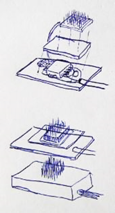

Our design of the active electrodes consists of two circuit boards, one designed explicitly for the pin connections and the other containing all the electronic components and pads for connecting the audio cable to the power supply for the operational amplifier and transmitting the signal to the EEG itself. These two PCBs are firmly soldered together using four solid brass pins located around the corners of these PCBs of identical size 14x22mm. Of these, one pin transmits the signal from the pins connecting to the skin to the other PCB where it is amplified and sent on.

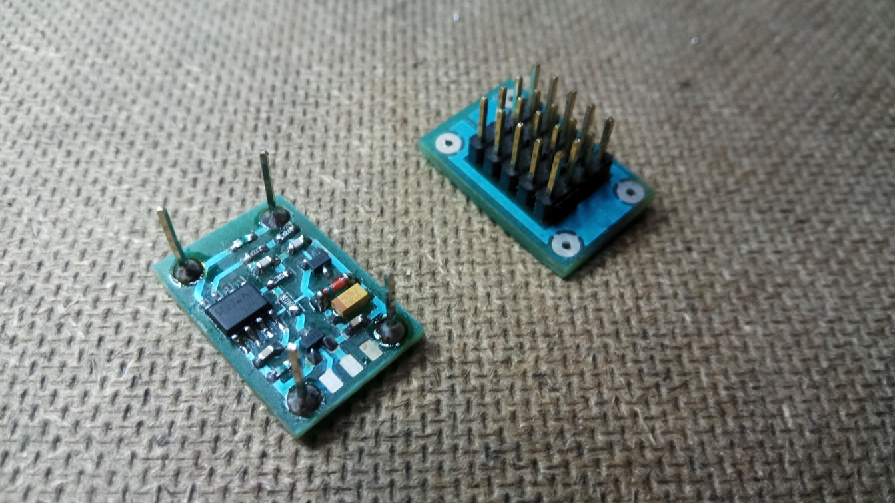

For easy placement on the rubber band, also easy movement on it and protection of electrical components we sealed the circuit with glue from a glue gun. This makes these electrodes the final product and suitable for use in any ModularEEG type EEG with the correct connection of the individual wires in the cable. The 3.5mm jack does not have to be used, but it is very suitable for this purpose, due to its widespread use, portability, reliability and above all the five pin female connection method, which I have only used in the third prototype. In short, it allows not to use all the electrodes while maintaining the correct functionality of the DRL, since the DRL needs to have all the electrodes connected to the body, they cannot remain unconnected (so called float). The usual method is to connect additional signal jumper cables to the V_REF virtual ground, however these female jacks allow automatic connection to this ground. Thus connecting when the electrode is not connected and of course disconnecting when the electrode is connected. The idea for this wiring was suggested to us by Stefan Jung, who emailed us asking for troubleshooting and understanding the functions of the various components of this particular EEG.

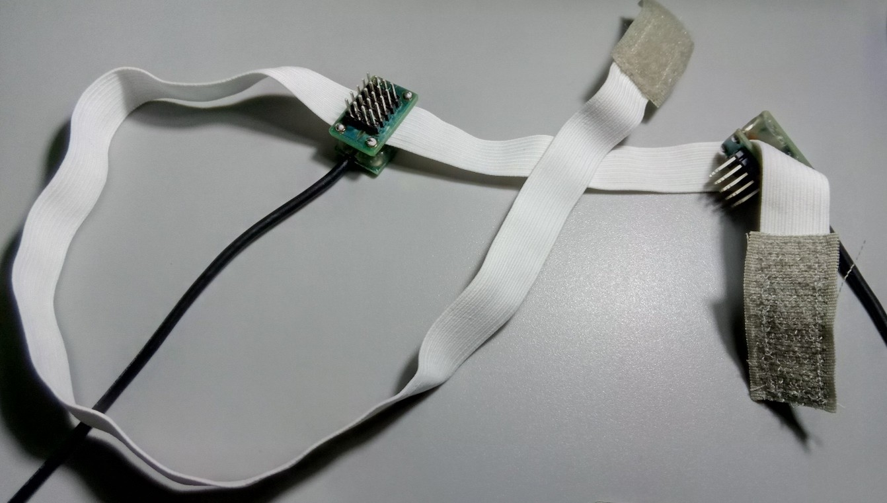

The procedure for their manufacture is quite straightforward and can be found in pictorial form as an appendix. We would only note that you have to be careful about the rotation of the components as well as the PCBs, because they are not symmetrical and can only be joined together with one side, one direction. Also, we do not recommend a cable length greater than 1.2m, as in similar designs cables around 2m long have shown malfunctions that are incompatible with the correct function of the device.

## Second prototype

Overall, Prototype 2 is a very neat and professionally done design. In addition to the radically different placement of components, the swapping of pins in the electrodes, and the removal of the MicroUSB connector, there are changes such as bringing out the control pins for electrode calibration and for DRL connection configuration and diagnosis. Further, the dimensions of the PCBs were sized exactly to the components used, a better power cascade and ground polygon, lettering for easy identification of the brought out pins, female jacks and trimmers on the board, a reduction in the number of interconnects through the PCB, the product name changed from the original EEG-SMT to EEG-RM (ReMake), and a simple serial number consisting of the date and version of the prototype was added. The already etched clean unmounted PCB of the second prototype:

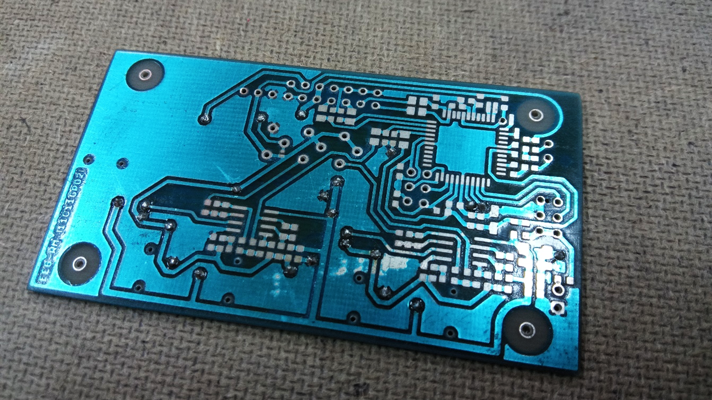

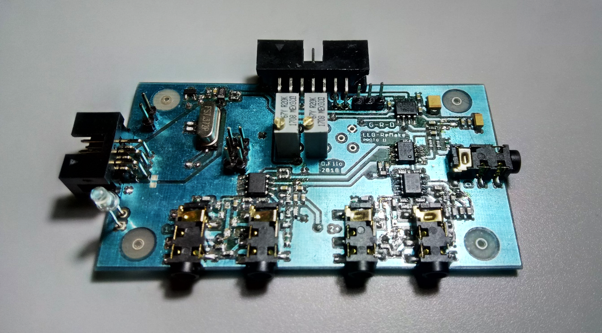

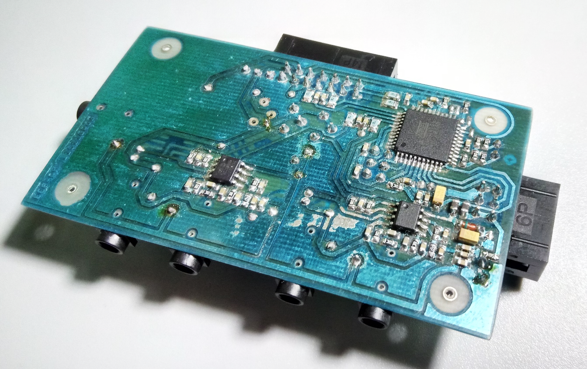

The big change was to combine the power and communication functions under one connector, the P/C connector. This original connection using the IDC 6pin connector allows you to create a set of P/C modules differing in the technologies used, power and isolation options under one universal connection method. We have placed emphasis on ensuring that incompatibilities do not arise in the future. In this way, compatibility is more or less guaranteed. Whether one uses wireless or conventional technology, as long as that technology can interpret UART, which is a very widespread and universal connection standard, there will be no problem with connectivity and application development.

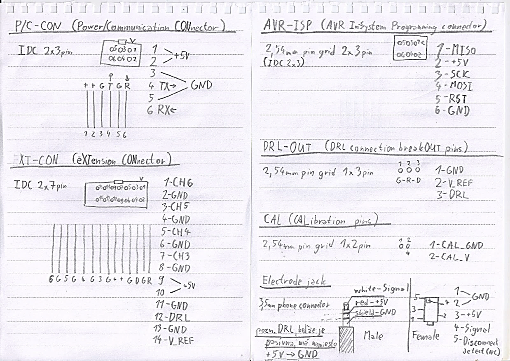

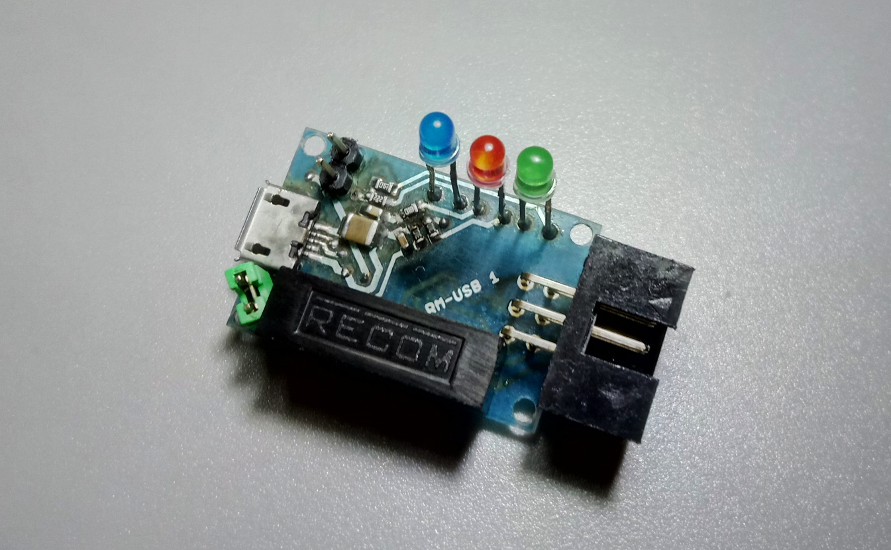

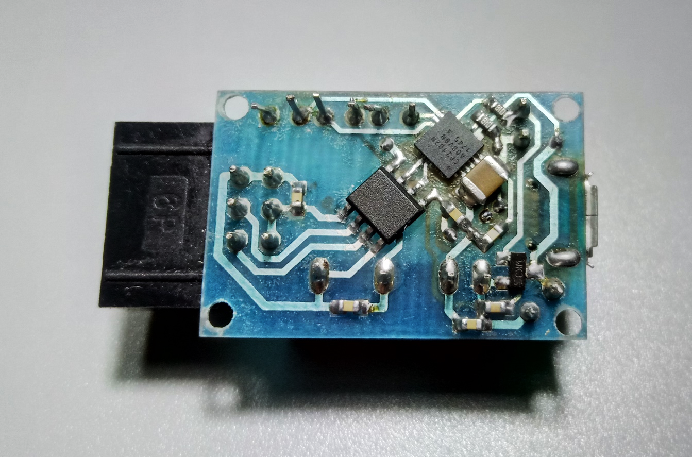

This release was supposed to solve all the shortcomings of prototype 1, but complications arose and due to our inattention it was not functional at first. (Version 110118P02)

The first error occurred in Eagle, where we needed to update the libraries and unfortunately that update switched the pads on the BAV199 protection diodes, causing a short circuit. Because the BAV199 diode has three pads to which it has two diodes connected in one direction: pass direction, center and stop direction, respectively. The confusion of plates 1 and 2 caused a theoretical short circuit between 5V and GND. By routing the 5V power supply through the individual junctions, it was easy to identify the source of the problem, but we unexpectedly discovered another problem. The turning of IC3, which more or less was in short circuit as well. The solution to this problem was to desolder the diodes and unsolder the integrated circuit, turn it over and re-solder it.

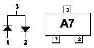

The communication with the computer was flawless, but the problem occurred only after connecting the electrodes to the head and especially the DRL electrode. Our signal, which consisted (at least) of an interference signal, completely disappeared or made no sense after connecting the DRL. We suspected the IC3 (part of the DRL circuit), due to the fact that we had inadvertently reversed it and a very large current was flowing through it. In the end, however, it turned out that we had just forgotten to connect the two pins intended for this in case we didn't use the tuning trimmer for the DRL. After connecting those pins, the EEG worked as it should.

The next logical step is to modify this design to correct the deficiencies that have arisen and, if necessary, to rethink the layout of the components once more. In version 170118P02, we corrected the diode wiring, but decided to make further, mainly cosmetic changes, which translated into prototype 3.

## Prototype 3

This version is not that different from the prototype 2, but it brings some mainly cosmetic changes and modifications to a few roads. Most of the changes are to the IC4 and the components around it. The trimmers are shifted. The crystal is rotated 90°, for easier fitting. Naming and names are relocated, optimized for their nicer etching. This is found in version 180118P03. The PCB layout and connections without ground fill:

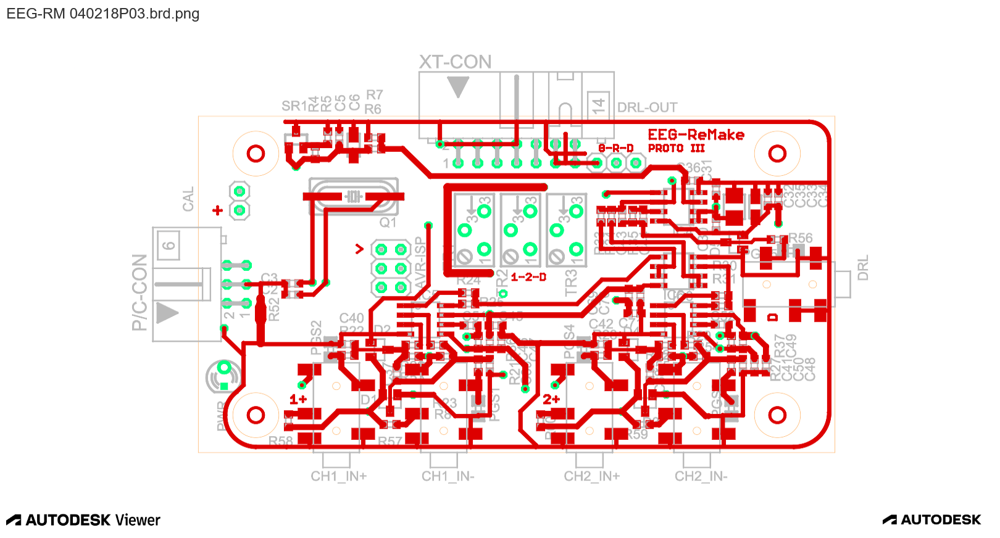

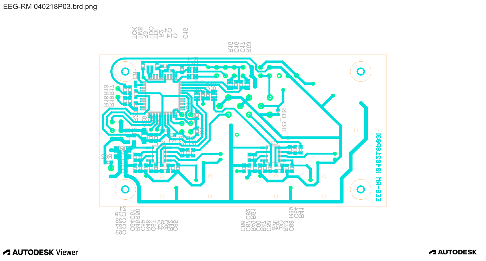

The 040218P03 version has in addition to this the already mentioned automatic disconnection/connection of the signal inputs to the amplifier to ground, necessary for the correct functioning of the DRL. This is basically the latest version of the EEG-RM, which has aspirations to become the final version.

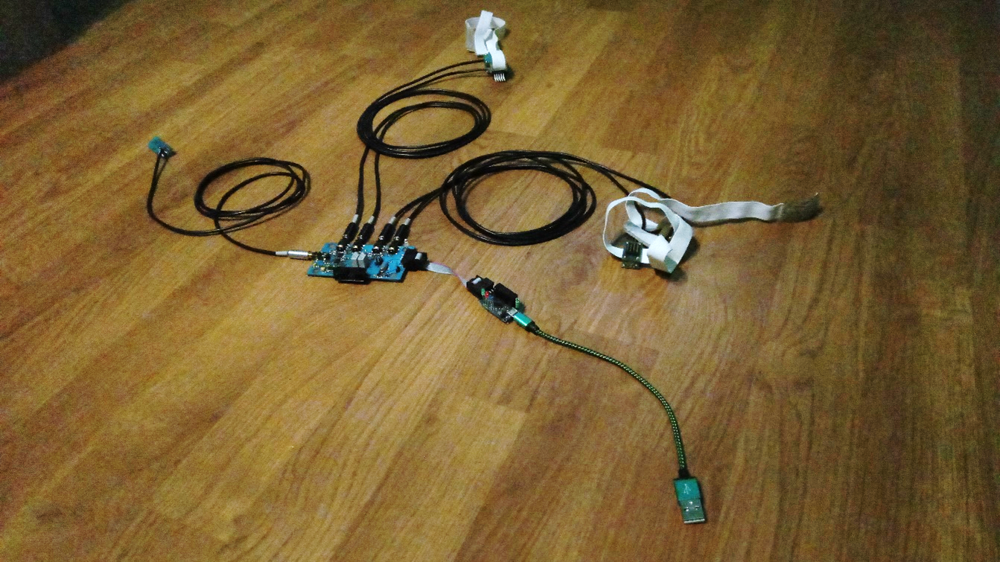

[Next page](./4_results.md)

*Translated by DeepL.*
