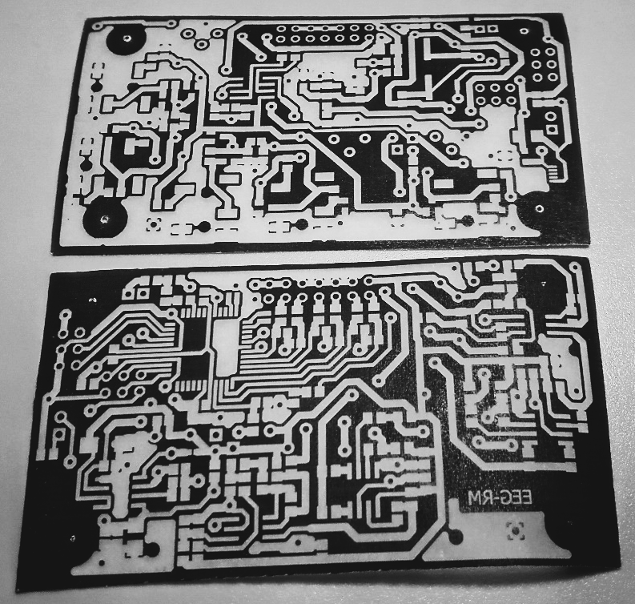
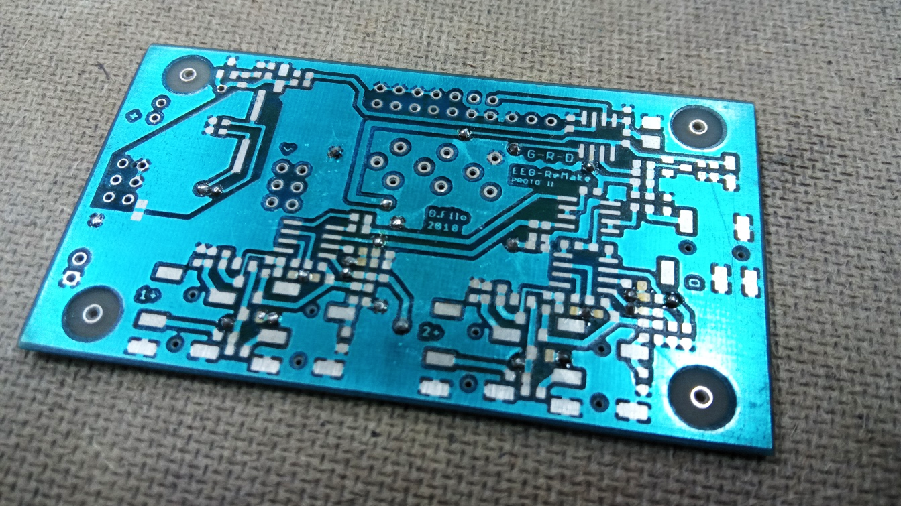
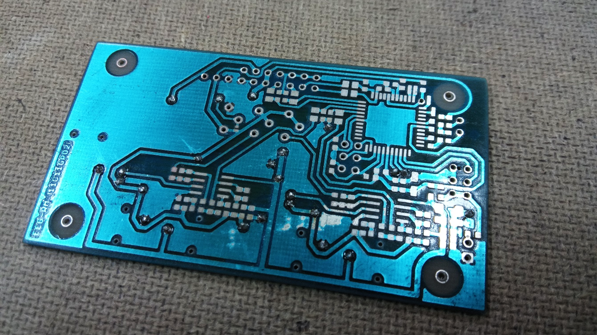
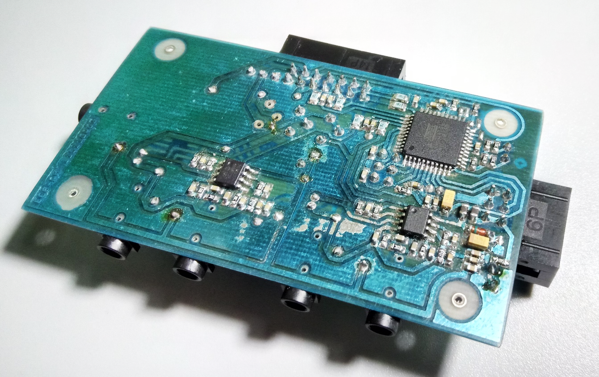
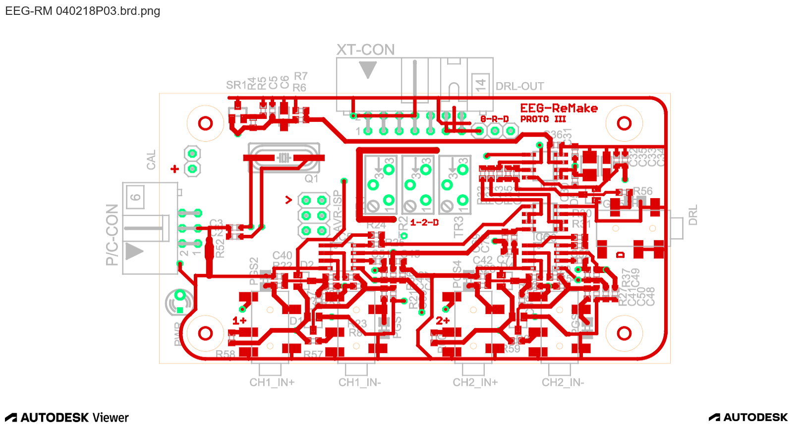
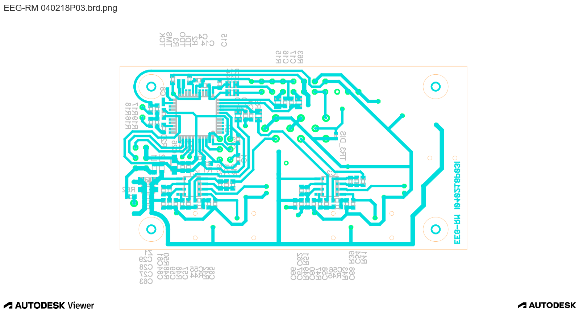

# Results

In the course of putting mental and physical work into this project, there have been minor and major problems. However, we can say with a clear conscience that we have done a great job. It was not easy like the ordinary and much-liked projects we have already done. We often had to look up the theory and methods used ourselves on foreign sources in English. That's why this thesis is also written mainly from our own experience gained in the last half a year. Although a huge amount of theory can be written on the subject of EEG, we decided to take a more concise route.

As far as the device itself is concerned, as has already been written, we did not avoid complications either. The first prototype, although not completely tested, showed signs of functionality, such as communication with a computer and interception of interfering signals. Its biggest problem, however, was its poorly thought out power supply and its cluttered design.

We produced the electrodes before the actual production of the second prototype with incompatible wiring for the first prototype. Therefore, we had to produce the second one urgently.

In the second prototype of the first version, we tried to make it more refined, simpler and clearer. However, this turned into even more serious problems. Diodes in short circuit and rotated operational amplifier. That's why we started to wonder if we shouldn't make a third prototype straight away, as we found a lot more problems than we had anticipated. However, the updated second prototype fixed the diode design and should be working smoothly. Despite this, we decided to invest some time improving and making the overall design a bit neater.

The third prototype integrates the seamless use of fewer channels while maintaining the functionality of the DRL. This is an excellent improvement over the second prototype. It further focuses on cosmetic and functional adjustments to the layout of the components.

Hoping that the third prototype will be the final version, we decided to produce a P/C module for isolated communication and power supply via USB. We managed to produce the module without any problems and the next logical step is to create a 3D printable box for it.

[Next page](./5_discussion.md)

*Translated by DeepL.*
