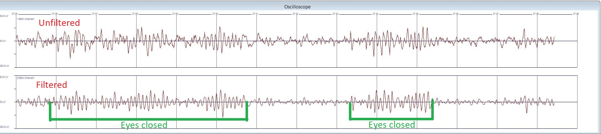

# Discussion

Initial testing of an already functional product was very interesting. There are many ways to test it. However, we chose the most obvious and most used: the eye-closing test (waking alpha rhythm). It was interesting to see how the invisible brain waves in the occipital lobe change based on whether our eyes are closed or open, whether we are in a level of relaxation or not...

Speaking of the occipital lobe, measurements of built up potentials, e.g. looking at a fixed flashing screen, must be very interesting as well. In this type of signal recording, averaging the signal and looking for deviations is very important, as these potentials are often overwhelmed by interference and "looking" for deviations is necessary.

Structurally, this product has succeeded, it can be fitted into a box and called self-made. It wasn't easy, but the journey was worth it. When one sets a goal, no matter how challenging, if one puts in adequate effort, one is destined to succeed.

The hardest part comes after that. The practical applications are wide and that is why it is difficult to find any ideal type of measurement. Different purposes - different requirements. Integrating real-time data analysis into the application of this equipment is not easy and can be inaccurate. However, thanks to the modularity, this problem is at least partially solved. People can build their own accessories to suit their needs, thus eliminating incompatibility and unsuitability of certain types of accessories to certain types of applications.

[Next page](./6_conclusion.md)

*Translated by DeepL.*
